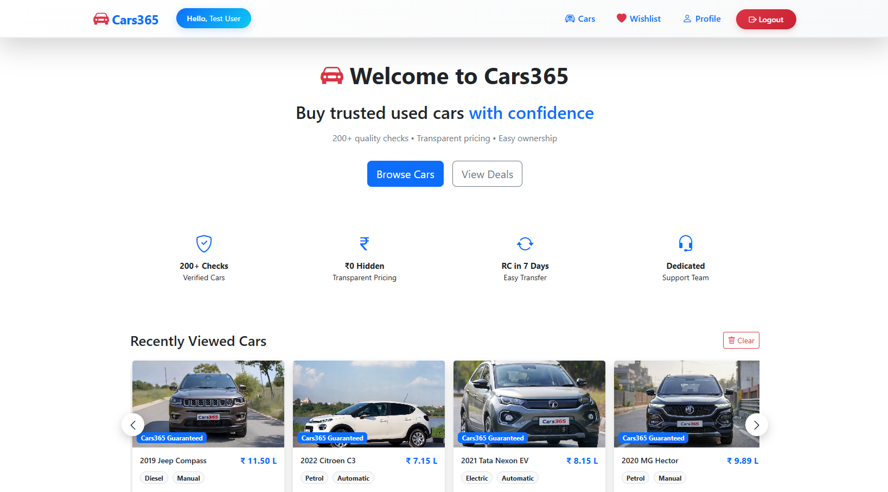
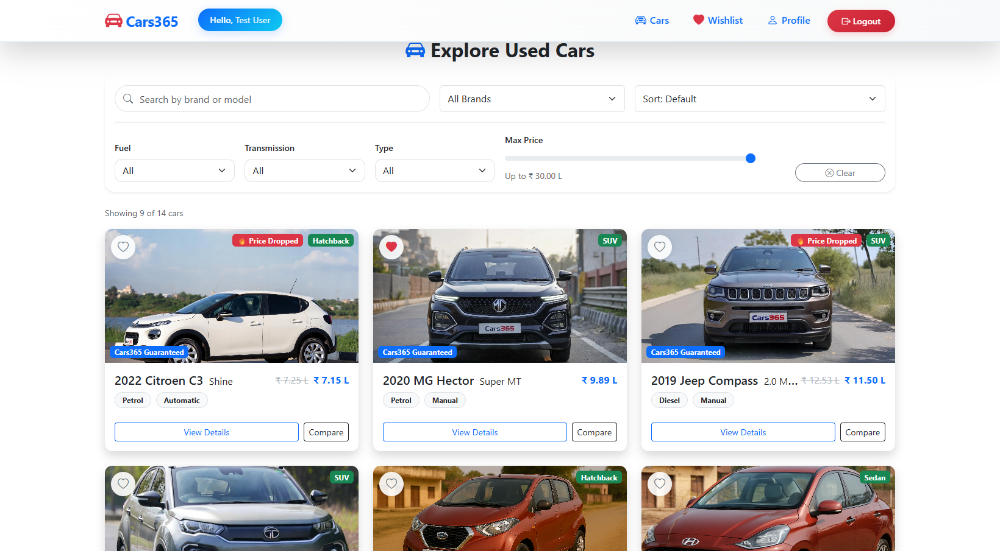
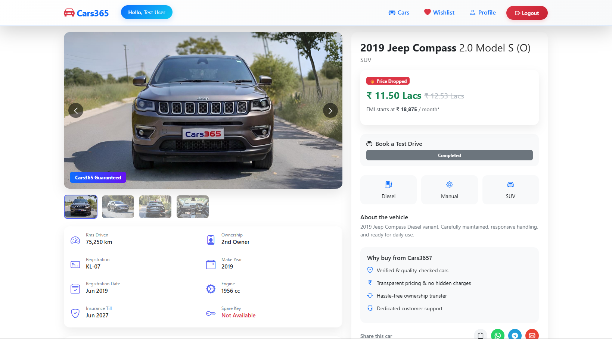
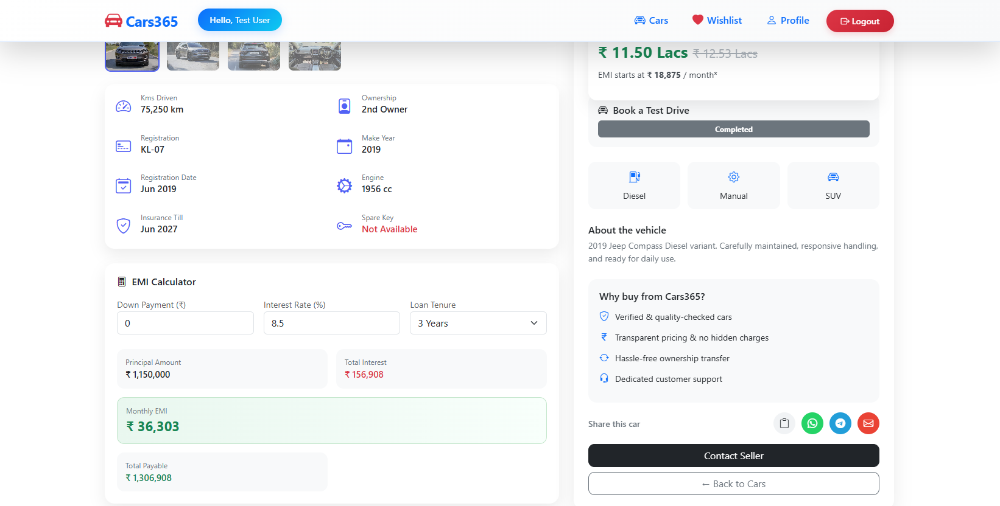
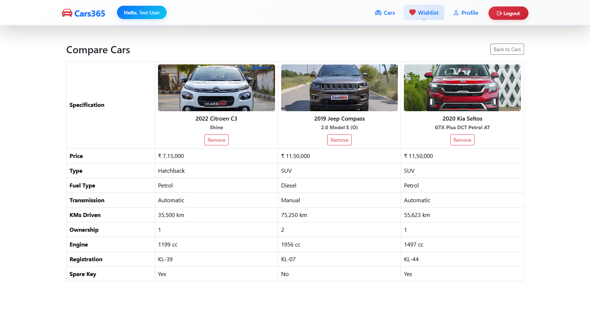
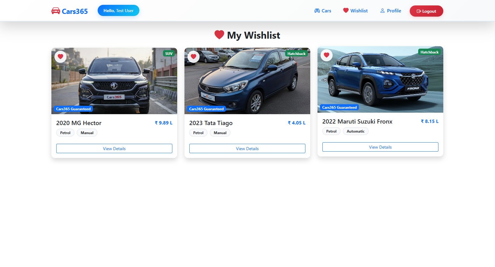
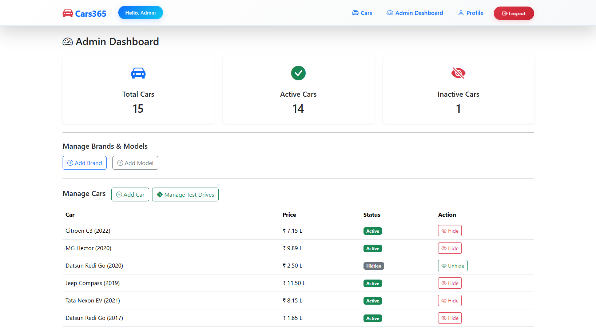
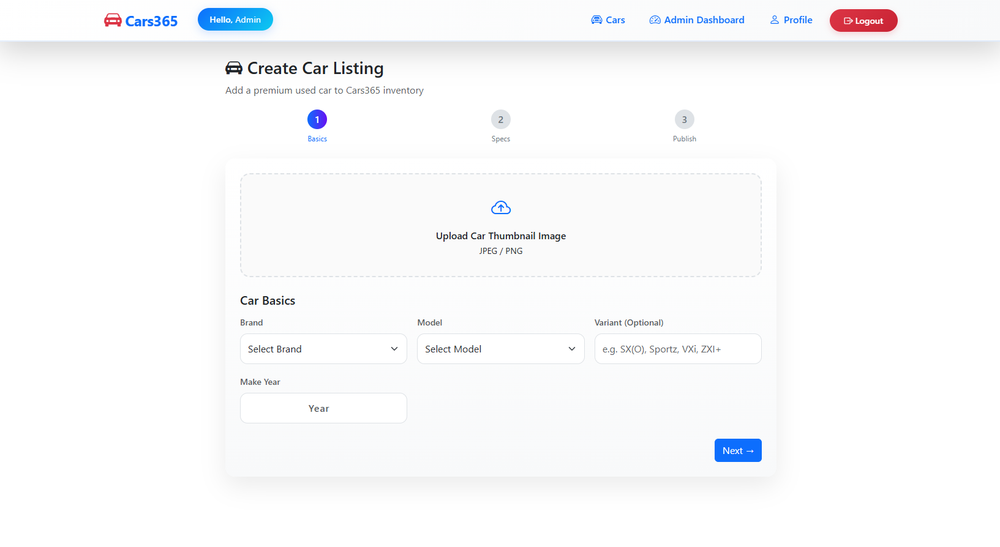

# 🚗 Cars365 — Trusted Used Car Marketplace

> A full-stack used car buying platform built with **Angular 19** and **ASP.NET Core Web API**, featuring car listings, test drive bookings, wishlist, car comparison, and a complete admin dashboard.

---

<!-- 📸 SCREENSHOT: Add a wide hero screenshot of your home page here -->



---

## 📌 Table of Contents

- [About the Project](#about-the-project)
- [Features](#features)
- [Tech Stack](#tech-stack)
- [Project Structure](#project-structure)
- [Getting Started](#getting-started)
- [Environment Setup](#environment-setup)
- [API Endpoints](#api-endpoints)
- [Screenshots](#screenshots)
- [Author](#author)

---

## 📖 About the Project

**Cars365** is a modern used car marketplace where users can browse verified cars, book test drives, save cars to a wishlist, and compare multiple cars side by side. Admins have a full dashboard to manage inventory, test drive requests, brands, and models.

The project was built as a full-stack learning project covering real-world concepts like JWT authentication, role-based access control, image uploads, and responsive UI design.

---

## ✨ Features

### 👤 User Features

- 🔍 Browse and search used cars with filters (fuel, transmission, type, price range, brand)
- 🚗 View detailed car information — specs, gallery, EMI calculator, insurance, registration
- ❤️ Add/remove cars from personal Wishlist
- 📅 Book a Test Drive with preferred date and time slot
- ↔️ Compare up to 3 cars side by side
- 👤 User profile management (name, phone, address)
- 🔐 Secure login & registration with JWT authentication
- 🔑 Change password from profile page
- 🕐 Auto logout when session expires
- 📱 Fully responsive on mobile and desktop

### 🛠️ Admin Features

- 📊 Admin Dashboard with total/active/inactive car stats
- ➕ Add new car listings with thumbnail image upload (3-step form)
- ✏️ Edit existing car listings
- 🖼️ Gallery image management — upload, reorder (drag & drop), set primary, delete
- 👁️ Hide/Unhide car listings
- 🗑️ Soft delete cars
- 🏷️ Manage Brands and Models
- 🚗 Manage Test Drive requests — Approve, Reject, Complete
- ✨ AI-style description generator for car listings
- 💰 Price drop tracking — previous price shown with strikethrough to users

---

## 🛠️ Tech Stack

### Frontend

| Technology      | Purpose                            |
| --------------- | ---------------------------------- |
| Angular 19      | Frontend framework                 |
| Bootstrap 5     | UI styling and components          |
| Bootstrap Icons | Icon library                       |
| Angular CDK     | Drag and drop for image reordering |
| TypeScript      | Language                           |
| RxJS            | Reactive programming               |

### Backend

| Technology                | Purpose               |
| ------------------------- | --------------------- |
| ASP.NET Core 8 Web API    | REST API              |
| Entity Framework Core     | ORM / Database access |
| SQL Server                | Database              |
| ASP.NET Core Identity     | User management       |
| JWT Bearer Authentication | Token-based auth      |
| C#                        | Language              |

---

## 📁 Project Structure

```
Cars365/
├── Cars365-ui/                  # Angular Frontend
│   └── src/
│       └── app/
│           ├── pages/
│           │   ├── home/        # Landing page
│           │   ├── cars/        # Car listing with filters
│           │   ├── car-details/ # Car detail page + EMI + Test Drive
│           │   ├── compare-cars/# Side by side comparison
│           │   ├── wish-list/   # User wishlist
│           │   ├── profile/     # User profile + test drives
│           │   ├── login/       # Login page
│           │   ├── register/    # Register page
│           │   └── admin/
│           │       ├── add-car/         # Add/Edit car form
│           │       ├── admin-dashboard/ # Stats + car management
│           │       └── test-drives/     # Test drive requests
│           ├── services/        # API service layer
│           ├── guards/          # Route guards (admin, guest)
│           ├── interceptors/    # HTTP auth interceptor
│           ├── shared/
│           │   ├── navbar/
│           │   ├── footer/
│           │   └── toast/
│           └── utils/           # Slug utility
│
└── Cars365.API/                 # ASP.NET Core Backend
    └── Cars365.API/
        ├── Controllers/         # API controllers
        ├── Models/              # EF Core entity models
        ├── DTOs/                # Data transfer objects
        └── Data/                # DbContext
```

---

<!--
## 🚀 Getting Started

### Prerequisites

Make sure you have the following installed:
- [Node.js](https://nodejs.org/) (v18+)
- [Angular CLI](https://angular.io/cli) (`npm install -g @angular/cli`)
- [.NET 8 SDK](https://dotnet.microsoft.com/download)
- [SQL Server](https://www.microsoft.com/en-us/sql-server) (or SQL Server Express)

---

### 1. Clone the repository

```bash
git clone https://github.com/your-username/Cars365.git
cd Cars365
```

---

### 2. Setup the Backend API

```bash
cd Cars365.API/Cars365.API
```

Update `appsettings.json` with your settings (see [Environment Setup](#environment-setup)).

Run database migrations:
```bash
dotnet ef database update
```

Start the API:
```bash
dotnet run
```

API will run at: `https://localhost:7193`

> On first run, the app automatically creates:
> - `Admin` and `User` roles
> - A default admin account: `admin@cars365.com` / `Admin@123`

---

### 3. Setup the Frontend

```bash
cd Cars365-ui
npm install
ng serve
```

App will run at: `http://localhost:4200`

---

## ⚙️ Environment Setup

### `appsettings.json` (Backend)

```json
{
  "ConnectionStrings": {
    "DefaultConnection": "Server=YOUR_SERVER;Database=Cars365DB;Trusted_Connection=True;TrustServerCertificate=True"
  },
  "Jwt": {
    "Key": "your-super-secret-key-minimum-32-characters",
    "Issuer": "cars365",
    "Audience": "cars365-users",
    "DurationInMinutes": 60
  }
}
```

> ⚠️ Never commit your real JWT key to GitHub. Use environment variables or secrets in production.

--- -->

## 📡 API Endpoints

### Auth

| Method | Endpoint                    | Access | Description             |
| ------ | --------------------------- | ------ | ----------------------- |
| POST   | `/api/auth/register`        | Public | Register new user       |
| POST   | `/api/auth/login`           | Public | Login and get JWT token |
| POST   | `/api/auth/change-password` | User   | Change password         |

### Cars

| Method | Endpoint                       | Access | Description            |
| ------ | ------------------------------ | ------ | ---------------------- |
| GET    | `/api/cars`                    | Public | Get all active cars    |
| GET    | `/api/cars/{id}`               | Public | Get car by ID          |
| POST   | `/api/cars`                    | Admin  | Add new car            |
| PUT    | `/api/cars/{id}`               | Admin  | Update car             |
| DELETE | `/api/cars/{id}`               | Admin  | Soft delete car        |
| PATCH  | `/api/cars/{id}/toggle-active` | Admin  | Hide/Unhide car        |
| GET    | `/api/cars/admin`              | Admin  | Get all cars for admin |
| GET    | `/api/cars/compare?ids=1,2,3`  | Public | Compare cars           |
| GET    | `/api/cars/dashboard-stats`    | Admin  | Get dashboard stats    |

### Car Images

| Method | Endpoint                             | Access | Description           |
| ------ | ------------------------------------ | ------ | --------------------- |
| POST   | `/api/cars/{id}/images`              | Admin  | Upload gallery images |
| GET    | `/api/cars/{id}/images`              | Public | Get car images        |
| PUT    | `/api/cars/{id}/images/reorder`      | Admin  | Reorder images        |
| DELETE | `/api/cars/images/{imageId}`         | Admin  | Delete image          |
| PUT    | `/api/cars/images/{imageId}/primary` | Admin  | Set primary image     |

### Brands & Models

| Method | Endpoint                  | Access | Description         |
| ------ | ------------------------- | ------ | ------------------- |
| GET    | `/api/brands`             | Public | Get all brands      |
| POST   | `/api/brands`             | Admin  | Add brand           |
| GET    | `/api/brands/{id}/models` | Public | Get models by brand |
| POST   | `/api/brands/{id}/models` | Admin  | Add model           |

### Wishlist

| Method | Endpoint                | Access | Description          |
| ------ | ----------------------- | ------ | -------------------- |
| GET    | `/api/wishlist`         | User   | Get wishlist         |
| POST   | `/api/wishlist/{carId}` | User   | Add to wishlist      |
| DELETE | `/api/wishlist/{carId}` | User   | Remove from wishlist |

### Test Drives

| Method | Endpoint                              | Access | Description         |
| ------ | ------------------------------------- | ------ | ------------------- |
| POST   | `/api/testdrive`                      | User   | Request test drive  |
| GET    | `/api/testdrive/my`                   | User   | Get my test drives  |
| PUT    | `/api/testdrive/{id}/cancel`          | User   | Cancel test drive   |
| GET    | `/api/admin/testdrives`               | Admin  | Get all test drives |
| PUT    | `/api/admin/testdrives/{id}/approve`  | Admin  | Approve test drive  |
| PUT    | `/api/admin/testdrives/{id}/reject`   | Admin  | Reject test drive   |
| PUT    | `/api/admin/testdrives/{id}/complete` | Admin  | Mark as completed   |

### Profile

| Method | Endpoint       | Access | Description    |
| ------ | -------------- | ------ | -------------- |
| GET    | `/api/profile` | User   | Get profile    |
| PUT    | `/api/profile` | User   | Update profile |

---

## 📸 Screenshots

> Add your screenshots inside a `screenshots/` folder in the root of the project.

### 🏠 Home Page


_Hero section with trust badges, recently viewed cars, and category cards_

### 🚗 Cars Listing


_Filter bar with search, brand, fuel, transmission, type, and price range_

### 🔍 Car Details



_Full spec breakdown, gallery with thumbnails, EMI calculator, test drive booking_

### ↔️ Compare Cars


_Side by side comparison table for up to 3 cars_

### ❤️ Wishlist


_Saved cars with quick access_

### 📊 Admin Dashboard


_Stats cards, car management table with hide/unhide_

### ➕ Add Car (3-Step Form)


_Step 1: Image + Basics, Step 2: Specs + Price, Step 3: Description + Gallery_

### 🚗 Test Drive Management


_Admin view of all test drive requests with approve/reject/complete actions_

---

<!--
## 🔐 Default Credentials

| Role | Email | Password |
|------|-------|----------|
| Admin | admin@cars365.com | Admin@123 |

> Create a regular user account through the Register page.

--- -->

## 🧠 Key Concepts Used

- **JWT Authentication** with role-based access (`Admin`, `User`)
- **Route Guards** — `adminGuard` and `guestGuard`
- **HTTP Interceptor** — auto-attaches Bearer token to every request
- **Soft Delete** — cars are never hard deleted, just flagged `IsDeleted = true`
- **EF Core** — eager loading with `.Include().ThenInclude()`
- **FormData** — multipart form uploads for car images
- **Reactive Forms** — with validation in Angular
- **Auto Logout** — JWT expiry timer with page refresh recovery
- **Price Drop Tracking** — previous price stored on update, shown as strikethrough

---

## 👨‍💻 Author

**Joel Stanley**

- GitHub: [@JoelVStan](https://github.com/JoelVStan)
- LinkedIn: [joel-varghese-stanley](https://www.linkedin.com/in/joel-varghese-stanley/)

---

## 📄 License

This project is for educational purposes.

---

> ⭐ If you found this project helpful, consider giving it a star on GitHub!
